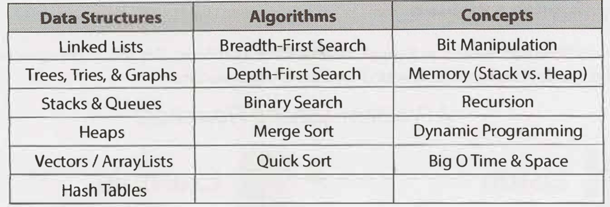
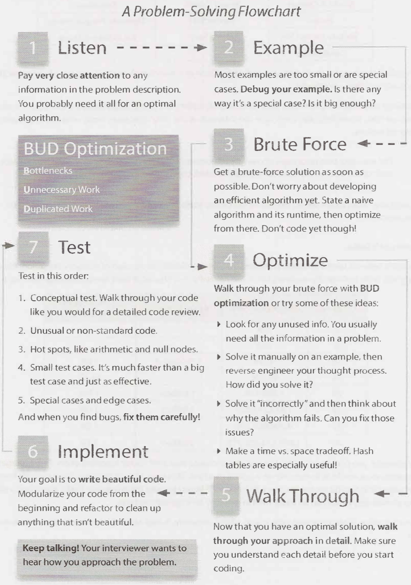
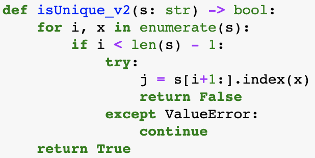
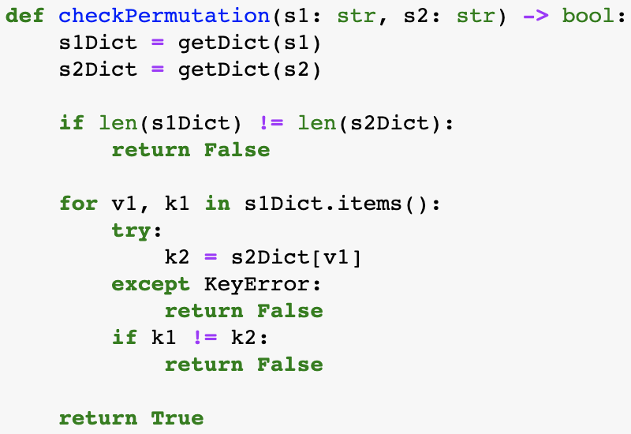
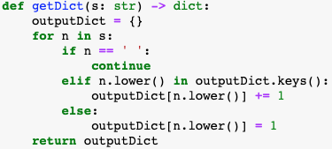
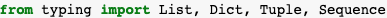

# Section 7 - Technical Questions

## Core Concepts

Understand how to implement them, and where application, space & time complexity

## Problem-Solving Flowchart

# Section 9 - Interview Questions

## Chapter 1 - Arrays and Strings

1. String can be enumerated as well

2. `index()` for Strings return *ValueError* if not found

   

3. Time complexity of Array operations (https://wiki.python.org/moin/TimeComplexity)

4. Dictionaries can be enumerated using `items()`, which returns (key, value) paris.

5. Dictionaries will aise a *KeyError* if value is not found

6. When creating dictionary from a String, be wary of cases and special characters (e.g. empty spaces)

7. For type hinting with List, Dict, etc., need to `import typing` first (https://docs.python.org/3/library/typing.html)

