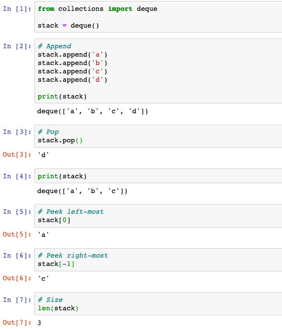
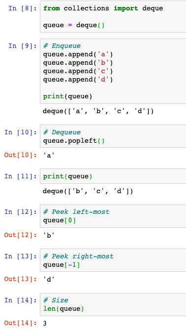
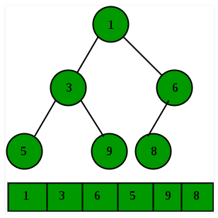

# Section 7 - Technical Questions

## Core Concepts


Understand how to implement them, and where application, space & time complexity

## Problem-Solving Flowchart


# Section 9 - Interview Questions

## Chapter 1 - Arrays and Strings

- String can be enumerated as well

- Should always ask, for a String, if the question is case-sensitive/whitespace-sensitive

- `index()` for Strings return *ValueError* if not found

   

- String can be sorted using

```python
sorted("abdc")
```

- Time complexity of Array operations (https://wiki.python.org/moin/TimeComplexity)
- Dictionaries can be enumerated using `items()`, which returns (key, value) paris.
- Dictionaries will aise a *KeyError* if value is not found


- When creating dictionary from a String, be wary of cases and special characters (e.g. empty spaces)


- Better yet, use collections.Counter(s)

- You cannot hash a word. You need to make it into tuple first

```python
dictionary = {}
for s in strs:
  s_sorted = tuple(sorted(s))
  if s_sorted in dictionary.keys():
    dictionary[s_sorted].append(s)
  else:
    dictionary[s_sorted] = [s]
```

- For type hinting with List, Dict, etc., need to `import typing` first (https://docs.python.org/3/library/typing.html)


- For reverse traversal, can simply

```python
for i in reversed(range(5)):
	print(i)

# Output
4
3
2
1
0
```

## Chapter 2 - Linked List

- Simple implementation in Python

```python
# Definition for singly-linked list.
class ListNode:
    
    # Initialization
    def __init__(self, x):
        self.val = x
        self.next = None
    
    # Print
    def print(self):
        output = ""
        if self:
            output += str(self.val)
        else:
            return ""
        if self.next:
            output += "->{0}".format(self.next.print())
        else:
            return output
        return output
      
# Function to take in a List of integers and initialize a linked list
# The Head node gets returned
def initLinkedList(s: List[int]) -> ListNode:
    if len(s) <= 0:
        return None
    
    head = ListNode(s[0])
    current = head
    
    for i in range(1, len(s)):
        temp = ListNode(s[i])
        current.next = temp
        current = temp
        
    return head
```

- In Python, when you pass in a ListNode as an argument, you pass in the reference!

- **Two Pointers**

   - Iterate through the LL with two points simultaneously, with one ahead of the other
   - Example to remove duplicate, with O(1) space but O(n^2) time

   ```python
   def RemoveDups_v3(head: ListNode) -> None:
       current = head
       while current:
           # Remove all future nodes that have the same value
           runner = current
           while runner.next:
               if runner.next.val == current.val:
                   runner.next = runner.next.next
               else:
                   runner = runner.next
           current = current.next
   ```

   - Example to detect cycle

```python
def hasCycle(self, head: ListNode) -> bool:
        slow = head
        fast = head
        while fast and fast.next:
            slow = slow.next
            fast = fast.next.next
            if slow == fast:
                return True
        return False
```

- Reversing a LL

```python
# Iterative
class Solution:
  def reverseList(self, head):
      prev = None
      while head:
          curr = head
          head = head.next
          curr.next = prev
          prev = curr
      return prev
```

```python
# Recursive
class Solution:
  def reverseList(self, head: ListNode) -> ListNode:
    return self._reverse(head)

  def _reverse(self, node, prev=None):
    if not node:
      return prev
    n = node.next
    node.next = prev
    return self._reverse(n, node)
```


## Chapter 3 - Stacks and Queues

- Implementing stacks and queues in Python using traditional list is NOT ideal
  - Slow - inserting and deleting an element at the beginning requires shifting all of theother elements by one, requiring O(n)
  - Memory issues - items in lists are stored next to each other in memory, if the stack/queue grows bigger than the block of memory that currently holds it, then Python needs to do some memory allocation
- Stack is LIFO
  - Can be used to implement a recursive algorithm intuitively
  - Python operations for a stack

```python
from collections import deque
stack = deque()
```

|         | Usage                                                        | Returns                        | Time Complexity |
| ------- | ------------------------------------------------------------ | ------------------------------ | --------------- |
| push    | stack.append('a')                                            | None, modifies in-place        | O(1)            |
| ==pop== | ==stack.pop()==                                              | ==The last inserted elements== | O(1)            |
| peek    | stack[0] - peeks leftmost (first added) <br /> stack[-1] - peeks rightmost (last added) | Leftmost/rightmost item        | O(1)            |
| size    | len(stack)                                                   | Length of stack                | O(1)            |



- Queue is FIFO

```python
from collections import deque
queue = deque()
```

|             | Usage                                                        | Returns                         | Time Complexity |
| ----------- | ------------------------------------------------------------ | ------------------------------- | --------------- |
| append      | queue.append('a')                                            | None, modifies in-place         | O(1)            |
| ==dequeue== | ==queue.popleft()==                                          | ==The first inserted elements== | O(1)            |
| peek        | queue[0] - peeks leftmost (first added) <br /> queue[-1] - peeks rightmost (last added) | Leftmost/rightmost item         | O(1)            |
| size        | len(queue)                                                   | Length of queue                 | O(1)            |



- To sort a stack (queue is similar)

```python
def sort_stack(stack : deque) -> deque:
    # Return stack, always sorted
    r = deque()
    
    # Iterates through each element in the given stack
    while (len(stack) > 0):
        # Pop the top element
        top = stack.pop()
        # Compare the top element with each element in the return stack
        # If the top of the return stack is LARGER than top, we can just push the top element onto the return stack
        # Otherwise, iterate through the return stack, and for any element that is smaller than top, push it onto the original stack
        while ((len(r) > 0) and (r[-1] < top)):
            tmp = r.pop()
            stack.append(tmp)
        # Finally, we now have everything in the return stack larger than the top element, simply push
        r.append(top)
    
    return r
```

# Chapter 4 - Trees and Graphs

- Need to know how to implement a tree/graph from scratch

## Trees

- A **binary tree** is a tree in which each node has *up to* two children
  - A node is called a **leaf** node if it has no children
- Definition for a binary tree:

```python
class Node:
  def __init__(self, x):
    self.val = x
    self.left = None
    self.right = None
  
  def __str__(self):
    return '('+str(self.left)+':L ' + "V:" + str(self.val) + " R:" + str(self.right)+')'
```

- A **binary search tree** is a binary tree in which every node fits a specific ording property: *all left descendents <= n < all right descendents*. ==Note that in this definition, BST does not have duplicate values, however, this could vary, so ask interviewer==
- A **balanced tree** is a tree whose heighr is of order of $\log{n}$, where n is the number of elements in the tree. It doesn't have to be "as balanced as it gets", but it is balanced enough to ensure $O(\log{n})$ times for insert and find
- A **complete binary tree** is a binary tree in which every level of thre tree is fully filled (except for perhaps the last level, where the rightmost elements could be missing)
- A **full binary tree** is a binary tree in which every node has either zero or two children. That is, no nodes have only one child
- A **perfect binary tree** is one that is both full and complete, i.e. all leaf nodes will be at the same level, and this level has the maximum number of nodes, must have exactly $2^k - 1$ nodes, where k is the number of levels
- In-Order Traversal - left, current, right
  - When this is performed on a BST, it visits the nodes in ascending order

```python
def inOrderTraversal(root):
  if root:
    inOrderTraversal(root.left)
    print(root.val)
    inOrderTraversal(root.right)
```

- Pre-Order Traversal - current, left, right
- Post-Order Traversal - left, right, current

## Heaps

- A **min-heap** is a complete binary tree where each node is smaller than its children. A max-heap would just be one where each node is larger than its children
- ==A heap is typicall represented as an array==, since it is complete we can do this



- Insert
  - First, insert at the rightmost spot, to preserve the complete property. In the array representation, we can simply append the item to the end of the array. This is implemented in the *insert* method below
  - Then, fix the tree by swapping the new element with its parent, until we find an appropriate spot for him. This is implemented in the *percUp* method below
  - Time complexity: $O(\log{n})$

```python
class BinHeap:
    def __init__(self):
        self.heapList = [0]
        self.currentSize = 0
        
    def percUp(self,i):
      	# The parent of node i is stored at index = i // 2
        while i // 2 > 0:
          # If the newly added element is smaller than its parent
          if self.heapList[i] < self.heapList[i // 2]:
             # Swap the two
             tmp = self.heapList[i // 2]
             self.heapList[i // 2] = self.heapList[i]
             self.heapList[i] = tmp
          i = i // 2

    def insert(self,k):
      self.heapList.append(k)
      self.currentSize = self.currentSize + 1
      self.percUp(self.currentSize)
```

- Extract minimum element
  - Finding it is easy - it's always at the top!
  - First, remove the minimum/top element, and swap it with the last element in the heap (rightmost element in the array)
  - Second, swap the new top with either the left child or the right child, depending on which one is smaller
  - Time complexity: $O(\log{n})$

```python
class BinHeap:
    def __init__(self):
        self.heapList = [0]
        self.currentSize = 0
        
    def percDown(self,i):
        while (i * 2) <= self.currentSize:
            # Find the minimum child of node i, whether if its left or right
            mc = self.minChild(i)
            # If node i is larger than at least one of its children, swap
            if self.heapList[i] > self.heapList[mc]:
                tmp = self.heapList[i]
                self.heapList[i] = self.heapList[mc]
                self.heapList[mc] = tmp
            i = mc

    def minChild(self,i):
        if i * 2 + 1 > self.currentSize:
            return i * 2
        else:
            # Compare left and right child
            if self.heapList[i*2] < self.heapList[i*2+1]:
                return i * 2
            else:
                return i * 2 + 1
              
    def delMin(self):
        # Minimum, i.e. top
        retval = self.heapList[1]
        # Swap with rightmost
        self.heapList[1] = self.heapList[self.currentSize]
        # Decrease size
        self.currentSize = self.currentSize - 1
        self.heapList.pop()
        self.percDown(1)
        return retval
```

- In Python, use *heapq* (heap queue) to implement min-heap

```python
import heapq

## Construction
H = [21,1,45,78,3,5]
heapq.heapify(H) # Note that this is in-place!
print(H)
# >> [1, 3, 5, 78, 21, 45]

## Insert
heapq.heappush(H,8)
print(H)
# >> [1, 3, 5, 78, 21, 45, 8]

## Removal
heapq.heappop(H)
# >> 1
print(H)
# >> [3, 21, 5, 78, 45, 8]

## Replace (removes the smallest element and inserts the new incoming element)
heapq.heapreplace(H, 6)
# >> 3
print(H)
# >> [5, 21, 6, 78, 25, 8]

## Peak the smallest element
H[0]

## Length
len(H)
```

## Graphs

- A **graph** is simply a collection of nodes with edges between (some of) them. A tree is a graph without cycles
- A **connected graph** is one where there's a path between every pair of vertices
- An **acyclic graph** is one without cycles, and thus can be represented using a tree
- We need a *Graph* class since it's not necessarily true that we can reach all nodes from a single node

```python
class Graph():

    def __init__(self, max_vertices):
        self.max_vertices = max_vertices
        self.vertices = [0] * self.max_vertices
        self.count = 0

    # x is a Node
    def addNode(self, x):
        if self.count < self.max_vertices:
            self.vertices[self.count] = x
            self.count += 1
        else:
            print "Graph full"

    def getNodes(self):
        return self.vertices


class Node():

    def __init__(self, vertex, adjacentLength):
        self.adjacent = [0] * adjacentLength
        self.vertex = vertex
        self.adjacentCount = 0
        self.visited = False # Useful for searching

    # x is a Node
    def addAdjacent(self, x):
        if self.adjacentCount < len(self.adjacent):
            self.adjacent[self.adjacentCount] = x
            self.adjacentCount += 1
        else:
            print "No more adjacent nodes can be added"

    def getAdjacent(self):
        return self.adjacent

    def getVertex(self):
        return self.vertex

# Construct a graph
sizegraph = 6
g = Graph(sizegraph)
temp = [0] * sizegraph

# vertex, adjacentLength
temp[0] = Node("a", 3)
temp[1] = Node("b", 0)
temp[2] = Node("c", 0)
temp[3] = Node("d", 1)
temp[4] = Node("e", 1)
temp[5] = Node("f", 0)

temp[0].addAdjacent(temp[1])
temp[0].addAdjacent(temp[2])
temp[0].addAdjacent(temp[3])
temp[3].addAdjacent(temp[4])
temp[4].addAdjacent(temp[5])

for i in range(sizegraph):
  g.addNode(temp[i])
  return g
```

- Breadth-First Search
  - Better if we want to find the shortest path between two nodes
  - Iterative implementation:

```python
def breadthfirstsearch(g, start, end):
    if start == end:
        return True
    # Enqueue, FIFO
    q = Queue.Queue(len(g.getNodes()))
    start.visited = True
    q.put(start)
    # Iterate until the Queue becomes empty
    while not q.empty():
        # Dequeue
        r = q.get()
        if r != None:
            adjacent = r.getAdjacent()
            # For each neighbour
            for i in range(len(adjacent)):
                # If neighbour hasn't been visited
                if adjacent[i].visited == False:
                    if adjacent[i] == end:
                        return True
                    else:
                        # Enqueue
                        q.put(adjacent[i])
                    adjacent[i].visited = True
    return False

breadthfirstsearch(g, n[0], n[5])
```

- Depth-First Search
  - Better if we want to visit every node in the graph
  - Can be implemented iteratively by using a Stack instead of Queue int he BFS algorithm above
  - Recursive implementation (pseudocode):

```python
def depthfirstsearch(root):
  if not root:
    return
  visit(root)
  root.visited = True
  for i in root.getAdjacent():
    if i.visited == False:
      depthfirstsearch(i)
```

